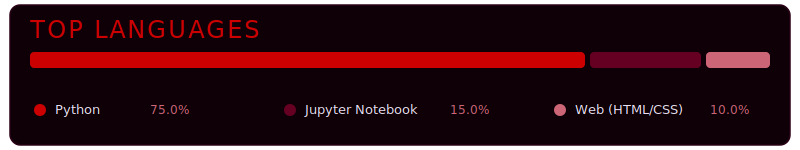

<div align="center">
  <!-- TOP HEADER -->
  

  <!-- WEB DIVIDER -->
  
</div>

---

### 〉 ABOUT.ME

```bash
ddd047@spidey-lab:~$ ./bio.sh
```

<div align="center">
  
</div>

---

### 〉 PROFILE.STATS

<div align="center">
  
</div>

---

### 〉 SKILLS.WEB

<div align="center">
  
</div>

---

### 〉 TECH.STACK

<div align="center">
  <!-- Languages -->
  
  &nbsp;
  
  &nbsp;
  
  &nbsp;
  
  
  <br><br>

  <!-- Frameworks & Data -->
  
  &nbsp;
  
  
  <br><br>

  <!-- OS & DevOps -->
  
  &nbsp;
  
  &nbsp;
  
</div>

---

### 〉 LANGUAGES.WEB

<div align="center">
  
</div>

<br>

<div align="center">
  
</div>

---

### 〉 LAB.ENVIRONMENT

```python
ddd047 = {
    "role"       : "AI/ML Enthusiast · B.Tech Student",
    "learning"   : ["Deep Learning", "NLP", "LLMs", "Computer Vision"],
    "building"   : "Something that will stick to walls (metaphorically)",
    "ask_me_about": ["Machine Learning", "Python", "AI Research"],
    "spider_sense": "Tingling whenever there's an underfitting model nearby"
}
```

---

### 〉 SOCIALS.WEB (INTERACTIVE)

<div align="center">
  <a href="https://github.com/ddd047" target="_blank"></a>
  &nbsp;
  <a href="https://www.linkedin.com/in/himanshu-dhiman-b30611321/" target="_blank"></a>
  &nbsp;
  <a href="https://twitter.com" target="_blank"></a>
  &nbsp;
  <a href="mailto:himanshu.hry26@gmail.com"></a>
  &nbsp;
  <a href="#"></a>
</div>

---

### 〉 CONTRIBUTION.WEB

<div align="center">
  <a href="https://github.com/ddd047" target="_blank">
    
  </a>
</div>

---

  <!-- FOOTER -->
<div align="center">
  
  <br>
  
  <br><br>
  
</div>

<!-- hello -->
